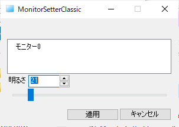

# ddcci-mfc

Sample MFC application of DDC/CI(Display Data Channel Command Interface).

Win32APIからDDC/CIでディスプレイの輝度を制御するサンプルです。

You can change monitor brightness with DDC/CI.

## Test

Run *x64/Release/MonitorSetterClassic.exe*.

## Using Methods

This sample application uses these methods:

- EnumDisplayMonitors
- GetPhysicalMonitorsFromHMONITOR
- GetNumberOfPhysicalMonitorsFromHMONITOR
- MonitorFromWindow
- GetMonitorBrightness
- SetMonitorBrightness

## Environments

Visual studio 2017

Tool set version : v141

Using dxva2.lib
